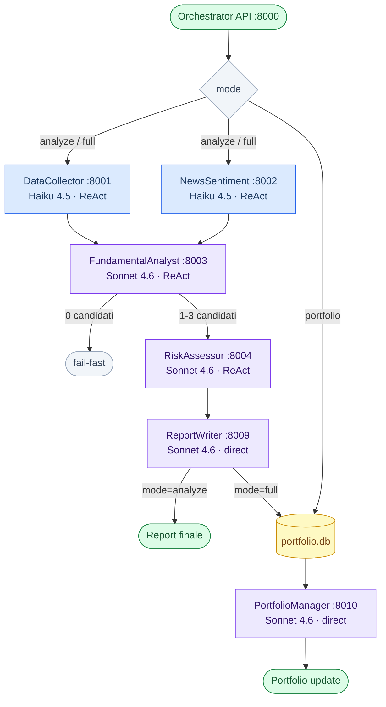
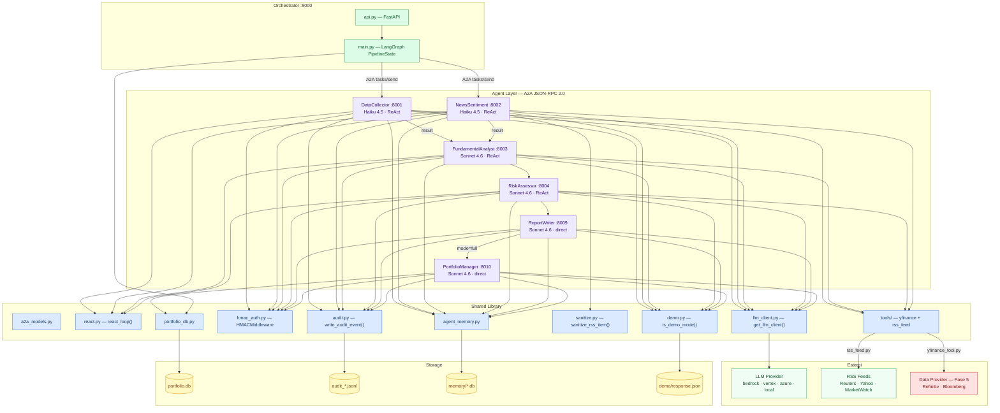

# Architecture — Equity Researcher A2A

## 1. Workflow Diagram

I tre workflow selezionabili via `mode`. Ogni nodo include modello LLM, tool esposti e scope funzionale.

---

## 2. Component Diagram

Dipendenze strutturali tra layer: Orchestrator, Agenti, Shared Library, Storage ed Esterni.

---

## Note evolutive

| Layer | Stato | Prossimi step |
|---|---|---|
| Data Provider | stub — `NotImplementedError` | Fase 5: Refinitiv LSEG o Bloomberg B-PIPE |
| RSS Feeds | operativo | Fase 5: verifica licenza commerciale |
| LLM Provider | `local` (test) / `bedrock` (prod) | Valutare Vertex per EU data residency |
| Storage | SQLite (`portfolio.db`) | Fase 5/6: upgrade a PostgreSQL |
| Agent Memory | SQLite per-agent (Fase A+B) | Fase futura: vector store per RAG |
| Auth | HMAC inter-agente opzionale | Fase 5: mutual TLS o API gateway |
| Orchestrator | LangGraph deterministico | LLM-ready: sostituire body nodi con `react_loop()` |
