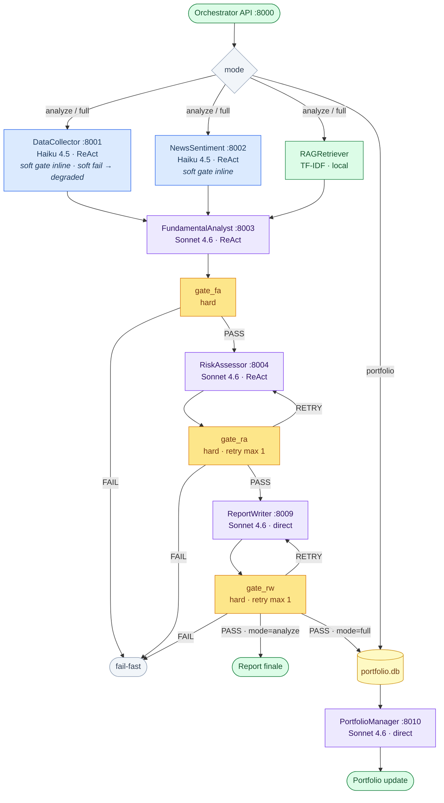

# Architecture — Equity Researcher A2A

## 1. Workflow Diagram

The three selectable workflows via `mode`. Hard gate nodes (yellow) validate each agent's output before it enters the next stage — they can fail-fast or trigger a reflection retry (max 1) with structured feedback injected into the agent prompt. Soft gate validation (DataCollector, NewsSentiment) runs inline inside each agent node to preserve the symmetric 3-edge AND-join at FundamentalAnalyst.

---

## 2. Component Diagram

Structural dependencies between layers: Orchestrator, Agents, Shared Library, Storage and Externals.

```mermaid
graph TB
    classDef agent   fill:#ede9fe,stroke:#7c3aed,color:#2e1065
    classDef shared  fill:#dbeafe,stroke:#2563eb,color:#1e3a5f
    classDef storage fill:#fef9c3,stroke:#ca8a04,color:#713f12
    classDef ext     fill:#f0fdf4,stroke:#16a34a,color:#14532d
    classDef orc     fill:#dcfce7,stroke:#15803d,color:#14532d
    classDef pending fill:#fee2e2,stroke:#dc2626,color:#7f1d1d
    classDef gate    fill:#fde68a,stroke:#d97706,color:#78350f

    subgraph EXTERNAL ["Esterni"]
        LLM_P["LLM Provider<br/>bedrock · vertex · azure · local"]:::ext
        RSS_P["RSS Feeds<br/>Reuters · Yahoo · MarketWatch"]:::ext
        DATA_P["Data Provider — Fase 5<br/>Refinitiv · Bloomberg"]:::pending
    end

    subgraph ORCHESTRATOR ["Orchestrator :8000"]
        API["api.py — FastAPI"]:::orc
        GRAPH["main.py — LangGraph PipelineState<br/><i>degraded: Annotated reducer</i>"]:::orc
        GATES["gates.py — 3 hard gate nodes<br/>FA · RA · RW + retry<br/><i>soft gates inlined in DC · NS</i>"]:::gate
        API --> GRAPH
        GRAPH --> GATES
    end

    subgraph AGENTS ["Agent Layer — A2A JSON-RPC 2.0"]
        DC["DataCollector :8001<br/>Haiku 4.5 · ReAct<br/><i>soft gate inline</i>"]:::agent
        NS["NewsSentiment :8002<br/>Haiku 4.5 · ReAct<br/><i>soft gate inline</i>"]:::agent
        FA["FundamentalAnalyst :8003<br/>Sonnet 4.6 · ReAct"]:::agent
        RA["RiskAssessor :8004<br/>Sonnet 4.6 · ReAct"]:::agent
        RW["ReportWriter :8009<br/>Sonnet 4.6 · direct"]:::agent
        PM["PortfolioManager :8010<br/>Sonnet 4.6 · direct"]:::agent
    end

    subgraph SHARED ["Shared Library"]
        A2A["a2a_models.py"]:::shared
        REACT["react.py — react_loop()"]:::shared
        LLC["llm_client.py — get_llm_client()"]:::shared
        HMAC["hmac_auth.py — HMACMiddleware"]:::shared
        AUDIT["audit.py — write_audit_event()"]:::shared
        DEMO["demo.py — is_demo_mode()"]:::shared
        SANITIZE["sanitize.py — sanitize_rss_item()"]:::shared
        TOOLS["tools/ — yfinance + rss_feed"]:::shared
        PORT_DB["portfolio_db.py"]:::shared
        MEM["agent_memory.py"]:::shared
        RAG_RET["rag_retriever.py — retrieve_context()"]:::shared
        PIPE_MDL["pipeline_models.py — intermediate Pydantic models"]:::shared
        VALIDATORS["validators.py — deterministic constraints"]:::shared
    end

    subgraph STORAGE ["Storage"]
        P_FILE[("portfolio.db")]:::storage
        A_FILE[("audit_*.jsonl")]:::storage
        M_FILE[("memory/*.db")]:::storage
        D_FILE[("demo/response.json")]:::storage
        R_FILE[("data/rag/documents/")]:::storage
    end

    GRAPH -->|"A2A tasks/send"| DC & NS
    DC & NS -->|result| FA
    FA --> RA --> RW
    RW -->|"mode=full"| PM

    DC & NS & FA & RA --> REACT
    DC & NS & FA & RA & RW & PM --> LLC
    DC & NS & FA & RA & RW & PM --> HMAC
    DC & NS & FA & RA & RW & PM --> AUDIT
    DC & NS & FA & RA & RW & PM --> DEMO
    DC & FA & RA --> TOOLS
    NS --> TOOLS
    NS --> SANITIZE
    PM & GRAPH --> PORT_DB
    DC & NS & FA & RA & RW & PM --> MEM

    GATES --> PIPE_MDL
    GATES --> VALIDATORS
    DC & NS --> PIPE_MDL

    LLC --> LLM_P
    TOOLS -->|"rss_feed.py"| RSS_P
    TOOLS -->|"yfinance_tool.py"| DATA_P

    AUDIT --> A_FILE
    PORT_DB --> P_FILE
    MEM --> M_FILE
    DEMO --> D_FILE
    GRAPH --> RAG_RET
    RAG_RET --> R_FILE
```

---

## Evolution Notes

| Layer | Status | Next steps |
|---|---|---|
| Data Provider | stub — `NotImplementedError` | Phase 5: Refinitiv LSEG or Bloomberg B-PIPE |
| RSS Feeds | operational | Phase 5: verify commercial license |
| LLM Provider | `local` (test) / `bedrock` (prod) | Evaluate Vertex for EU data residency |
| Storage | SQLite (`portfolio.db`) | Phase 5/6: upgrade to PostgreSQL |
| Agent Memory | SQLite per-agent (Phase A+B) | Future phase: vector store for RAG |
| RAG Retriever | TF-IDF keyword (operational) | Phase 5+: embedding-based with Bedrock Titan on pgvector/ChromaDB |
| RAG Documents | 11 synthetic documents in `data/rag/documents/` | Replace with real internal documentation |
| Auth | optional inter-agent HMAC | Phase 5: mutual TLS or API gateway |
| Orchestrator | deterministic LangGraph — `degraded` uses `Annotated` reducer for parallel writes | LLM-ready: replace node bodies with `react_loop()` |
| Validation Gates | 3 hard gate nodes in graph (FA · RA · RW); soft gates (DC · NS) inlined in agent nodes to preserve AND-join fan-in | Extend retry budget or add fallback agents in Phase 5 |
| DataCollector | soft fail — errors recorded in `degraded`, pipeline continues | Restore hard fail in Phase 5 when certified data provider is integrated |
