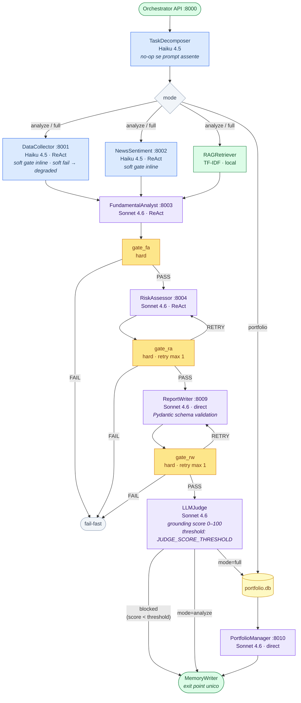

# Architecture — Equity Researcher A2A

## 1. Workflow Diagram

The three selectable workflows via `mode`. The pipeline starts with **TaskDecomposer** (no-op when no prompt is provided) and ends with **MemoryWriter** as the single exit point for all branches. Hard gate nodes (yellow) validate each agent's output before the next stage — they can fail-fast or trigger a reflection retry (max 1) with structured feedback injected into the agent prompt. Soft gate validation (DataCollector, NewsSentiment) runs inline inside each agent node to preserve the symmetric 3-edge AND-join at FundamentalAnalyst.



---

## 2. Guardrails

Three layers of deterministic control that run at zero LLM cost (A, B) or as an independent LLM check (C).

| ID | Nome | Dove | Cosa fa |
|---|---|---|---|
| **A** | Ticker validation | `shared/validators.py` → `run_pipeline()` | Blocca ticker LSE (`.L`), crypto/DeFi e formato non valido prima che la pipeline parta. `ValueError` → HTTP 400 nell'API. |
| **B** | Pydantic schema enforcement | `agents/report-writer/report_writer.py` | Dopo `json.loads()`, `Report.model_validate()` garantisce la conformità allo schema. `ValidationError` → `A2ATaskResult.fail()` → retry via `gate_rw`. |
| **C** | Grounding score threshold | `orchestrator/main.py` → `node_llm_judge` | Se `judgment.grounding_score < JUDGE_SCORE_THRESHOLD` (default 60, env var), scrive `degraded["judge_blocked"]` e `_route_after_judge` salta il branch portfolio. |

Altri guardrail pre-esistenti:

| Tipo | Componente | Funzione |
|---|---|---|
| Input sanitization | `shared/sanitize.py` + `news_sentiment.py` | Strip HTML, bidi override; NFKC + Cyrillic lookalike normalisation prima dei pattern check; pattern sintattici + semantici + base64 redaction; cross-field split injection detection; separazione strutturale XML nel tool result di NewsSentiment. Tutti i gap del red team giugno 2026 chiusi. |
| Behavioral constraints | Prompt di sistema agenti | Universo US/EU, settori esclusi, lingua italiana |
| Soft gate DC/NS | `node_data_collector`, `node_news_sentiment` | Validazione payload inline, degraded graceful |
| Hard gates FA/RA/RW | `orchestrator/gates.py` | Fail-fast o retry con feedback strutturato |
| QA pass | `report_writer.py` interno | Seconda chiamata LLM: schema, citation, scoring |
| Domain validator | `shared/validators.py` → `validate()` | Deterministic: UK stocks (`.L|.LON|.LN|.XL`), crypto (keyword + frasi: "digital asset", "on-chain"), direttive (con NFKC + Cyrillic lookalike normalisation), citation format, score range |

---

## 3. Task Decomposition

Il **TaskDecomposer** è il primo nodo del grafo LangGraph. Riceve un prompt in linguaggio naturale e ne estrae parametri strutturati (`TaskDecomposition`) che parametrizzano i nodi a valle.

```
run_pipeline(prompt="Analizza opportunità AI europee con orizzonte 3 mesi")
    → node_task_decomposer (Haiku 4.5)
    → TaskDecomposition {
        intent: "sector_screen",
        tickers: [],
        mode: "analyze",
        research_focus: "Opportunità nel settore AI europeo con orizzonte ~12 settimane",
        sectors: ["AI", "Semiconductors"],
        horizon_weeks: 12,
        constraints: ["EU only"]
      }
    → iniettato in: NewsSentiment (topic RSS), FundamentalAnalyst (istruzione), RiskAssessor (horizon_weeks), ReportWriter (user_prompt)
```

### Extended thinking

In LLM mode il decomposer usa **extended thinking** (`claude-sonnet-4-6`, `budget_tokens=8000`). La risposta contiene due blocchi: un `ThinkingBlock` con la catena di ragionamento e un `TextBlock` con il JSON strutturato. Il `ThinkingBlock` viene salvato in `TaskDecomposition.rationale` e passato agli agenti downstream.

In DEMO_MODE `_synthetic_rationale()` costruisce un rationale deterministico basato sui parametri estratti — esercita il path di iniezione senza chiamate LLM.

**Priorità di iniezione negli agenti:**
```
rationale presente  →  "RAGIONAMENTO DEL PIANIFICATORE: ..."  (CoT completo)
rationale assente   →  "FOCUS DELLA RICERCA: ..."             (sintesi)
entrambi assenti    →  comportamento default dell'agente
```

**Modalità di utilizzo:**

| Input | Comportamento |
|---|---|
| Solo `--prompt` | Decomposer estrae tickers, mode, focus dal testo; produce rationale CoT |
| `--tickers` + `--prompt` | Tickers espliciti + quelli estratti (merge, espliciti precedono); focus e rationale dal prompt |
| Solo `--tickers` | Decomposer è no-op, pipeline invariata |

**API:**
```json
{ "tickers": [], "mode": "analyze", "prompt": "Trova candidati nel settore semiconduttori europei con catalizzatori nel Q3 2026" }
```

**CLI:**
```bash
uv run python orchestrator/main.py --prompt "Confronta AAPL e MSFT sul momentum post-earnings" --mode analyze
```

---

## 4. Component Diagram

Structural dependencies between layers: Orchestrator, Agents, Shared Library, Storage and Externals.

```mermaid
graph TB
    classDef agent   fill:#ede9fe,stroke:#7c3aed,color:#2e1065
    classDef shared  fill:#dbeafe,stroke:#2563eb,color:#1e3a5f
    classDef storage fill:#fef9c3,stroke:#ca8a04,color:#713f12
    classDef ext     fill:#f0fdf4,stroke:#16a34a,color:#14532d
    classDef orc     fill:#dcfce7,stroke:#15803d,color:#14532d
    classDef pending fill:#fee2e2,stroke:#dc2626,color:#7f1d1d
    classDef gate    fill:#fde68a,stroke:#d97706,color:#78350f
    classDef tool    fill:#f1f5f9,stroke:#64748b,color:#334155

    subgraph EXTERNAL ["Esterni"]
        LLM_P["LLM Provider<br/>bedrock · vertex · azure · local"]:::ext
        RSS_P["RSS Feeds<br/>Reuters · Yahoo · MarketWatch"]:::ext
        DATA_P["Data Provider — Fase 5<br/>Refinitiv · Bloomberg"]:::pending
    end

    subgraph ORCHESTRATOR ["Orchestrator :8000"]
        API["api.py — FastAPI<br/><i>prompt: str | None</i>"]:::orc
        DECOMP["task_decomposer<br/>Haiku 4.5 · TaskDecomposition"]:::orc
        GRAPH["main.py — LangGraph PipelineState<br/><i>degraded: Annotated reducer</i>"]:::orc
        GATES["gates.py — 3 hard gate nodes<br/>FA · RA · RW + retry<br/><i>soft gates inlined in DC · NS</i>"]:::gate
        JUDGE_N["llm_judge — grounding check<br/><i>JUDGE_SCORE_THRESHOLD</i>"]:::orc
        API --> DECOMP --> GRAPH
        GRAPH --> GATES
        GRAPH --> JUDGE_N
    end

    subgraph AGENTS ["Agent Layer — A2A JSON-RPC 2.0"]
        DC["DataCollector :8001<br/>Haiku 4.5 · ReAct<br/><i>soft gate inline</i>"]:::agent
        NS["NewsSentiment :8002<br/>Haiku 4.5 · ReAct<br/><i>soft gate inline</i>"]:::agent
        FA["FundamentalAnalyst :8003<br/>Sonnet 4.6 · ReAct"]:::agent
        RA["RiskAssessor :8004<br/>Sonnet 4.6 · ReAct"]:::agent
        RW["ReportWriter :8009<br/>Sonnet 4.6 · direct<br/><i>Pydantic schema validation</i>"]:::agent
        PM["PortfolioManager :8010<br/>Sonnet 4.6 · direct"]:::agent
    end

    subgraph SHARED ["Shared Library"]
        A2A["a2a_models.py"]:::shared
        REACT["react.py — react_loop()"]:::shared
        LLC["llm_client.py — get_llm_client()"]:::shared
        HMAC["hmac_auth.py — HMACMiddleware"]:::shared
        AUDIT["audit.py — write_audit_event()"]:::shared
        DEMO["demo.py — is_demo_mode()"]:::shared
        SANITIZE["sanitize.py — sanitize_rss_item()"]:::shared
        TOOLS["tools/ — yfinance + rss_feed"]:::shared
        PORT_DB["portfolio_db.py"]:::shared
        MEM["agent_memory.py"]:::shared
        RAG_RET["rag_retriever.py — retrieve_context()"]:::shared
        MODELS["models.py — Report · TaskDecomposition<br/>Correction · pipeline models"]:::shared
        VALIDATORS["validators.py — validate() · validate_tickers()"]:::shared
        JUDGE_LIB["llm_judge.py — run_judge()"]:::shared
    end

    subgraph STORAGE ["Storage"]
        P_FILE[("portfolio.db")]:::storage
        A_FILE[("audit_*.jsonl")]:::storage
        RAW_FILE[("output/raw_*.json")]:::storage
        M_FILE[("memory.db")]:::storage
        D_FILE[("demo/response.json")]:::storage
        R_FILE[("data/rag/documents/")]:::storage
        C_FILE[("checkpoints.db")]:::storage
    end

    subgraph OFFLINE ["Offline Tools (analysis/)"]
        HARNESS["harness_analyzer.py<br/>offline · scheduled<br/><i>WeaknessReport JSON</i>"]:::tool
    end

    GRAPH -->|"A2A tasks/send"| DC & NS
    DC & NS -->|result| FA
    FA --> RA --> RW
    RW -->|"mode=full, not blocked"| PM

    DC & NS & FA & RA --> REACT
    DC & NS & FA & RA & RW & PM --> LLC
    DC & NS & FA & RA & RW & PM --> HMAC
    DC & NS & FA & RA & RW & PM --> AUDIT
    DC & NS & FA & RA & RW & PM --> DEMO
    DC & FA & RA --> TOOLS
    NS --> TOOLS
    NS --> SANITIZE
    PM & GRAPH --> PORT_DB
    DC & NS & FA & RA & RW & PM --> MEM

    GATES --> MODELS
    GATES --> VALIDATORS
    DC & NS --> MODELS

    RW --> MODELS
    JUDGE_N --> JUDGE_LIB
    DECOMP --> MODELS

    LLC --> LLM_P
    TOOLS -->|"rss_feed.py"| RSS_P
    TOOLS -->|"yfinance_tool.py"| DATA_P

    AUDIT --> A_FILE
    PORT_DB --> P_FILE
    MEM --> M_FILE
    DEMO --> D_FILE
    GRAPH --> RAG_RET
    RAG_RET --> R_FILE
    GRAPH --> C_FILE
    GRAPH --> RAW_FILE

    HARNESS -->|reads| A_FILE
    HARNESS -->|reads| RAW_FILE
    HARNESS --> LLC
    HARNESS --> VALIDATORS
    HARNESS --> MODELS
```



### Offline Tools

`analysis/harness_analyzer.py` — LLM-powered monitoring tool that runs **outside** the pipeline, offline and on demand (or as a scheduled job). It reads `output/raw_*.json` (full pipeline state per run) and `output/audit_*.jsonl` (per-agent execution events), correlates them by run UUID, and aggregates validator violations, judge issues, agent failures and degraded flags into a `TracesSummary`. The summary is sent to `claude-sonnet-4-6` which returns a structured `WeaknessReport`: one `WeaknessPattern` per systematic finding, each with `hypothesis`, `suggested_fix`, `confidence` and `target` (`system_prompt_rule | few_shot_example | tool_config | retry_logic`).

Design constraint: **no runtime self-modification**. Output is a human-readable diagnosis; engineers apply fixes through normal change management. In `DEMO_MODE=true` the LLM call is skipped automatically. Use `--no-llm` for stats-only output without any LLM provider requirement.

---

## 5. Evolution Notes

| Layer | Status | Next steps |
|---|---|---|
| Data Provider | stub — `NotImplementedError` | Phase 5: Refinitiv LSEG or Bloomberg B-PIPE |
| RSS Feeds | operational | Phase 5: verify commercial license |
| LLM Provider | `local` (test) / `bedrock` (prod) | Evaluate Vertex for EU data residency |
| Storage | SQLite (`portfolio.db`, `memory.db`, `checkpoints.db`) | Phase 5/6: upgrade to PostgreSQL |
| Agent Memory | SQLite per-agent (Phase A+B); UI visualization: memory.db cylinder in streaming dashboard (load stats on FA, written state on MemoryWriter, cross-run loop label) | Future phase: vector store for RAG |
| RAG Retriever | TF-IDF keyword (operational) | Phase 5+: embedding-based with Bedrock Titan on pgvector/ChromaDB |
| RAG Documents | 11 synthetic documents in `data/rag/documents/` | Replace with real internal documentation |
| Auth | optional inter-agent HMAC | Phase 5: mutual TLS or API gateway |
| Orchestrator | deterministic LangGraph — `degraded` uses `Annotated` reducer for parallel writes | LLM-ready: replace node bodies with `react_loop()` |
| Validation Gates | 3 hard gate nodes in graph (FA · RA · RW); soft gates (DC · NS) inlined in agent nodes to preserve AND-join fan-in | Extend retry budget or add fallback agents in Phase 5 |
| DataCollector | soft fail — errors recorded in `degraded`, pipeline continues | Restore hard fail in Phase 5 when certified data provider is integrated |
| Guardrails | A (ticker validation) · B (Pydantic schema on ReportWriter output) · C (judge score threshold) | Adversarial test suite: 171 tests. Tutti i gap del red team giugno 2026 chiusi. `TestKnownGapsNotBlocked` vuota. |
| Task Decomposition | NL prompt → `TaskDecomposition` via Sonnet + extended thinking (8k budget); `rationale` CoT iniettato in FA e ReportWriter; `horizon_weeks` passato a RiskAssessor per calibrare `fit_orizzonte`; no-op if prompt absent | Extend intent set (pending Bedrock — non verificabile in DEMO_MODE) |
| Prompt Caching | `cache_control: {"type": "ephemeral"}` su system prompt + initial user message in `react_loop()` (delta processing: turni 2–N pagano solo i tool results); system prompt in `_call_claude()` (ReportWriter); system + rag_context block in `run_judge()`. Cache token counts loggati in `react.cache` (DEBUG) e `judge.completed` structlog. 9 test strutturali in `test_caching.py`. | Verificare `cache_read_input_tokens > 0` su run reale (non testabile in DEMO_MODE) |
| Session Management | `max_tool_result_chars=8000` in `react_loop()`: cap su singoli tool result prima che entrino nella message history — impedisce a payload grandi di gonfiare il delta su ogni turno successivo. `react.context` log (DEBUG) per budget visibility (history_chars + stima token). 2 nuovi test strutturali in `test_caching.py` (`TestReactLoopSessionManagement`). Session memory già bounded: `read_ticker_history(limit=5)`, `read_recent_runs(limit=3)`, `MAX_NEWS_PAYLOAD`, `MAX_CANDIDATES_PAYLOAD`. | Monitorare `react.tool_result_truncated` in log per tarare il cap |
